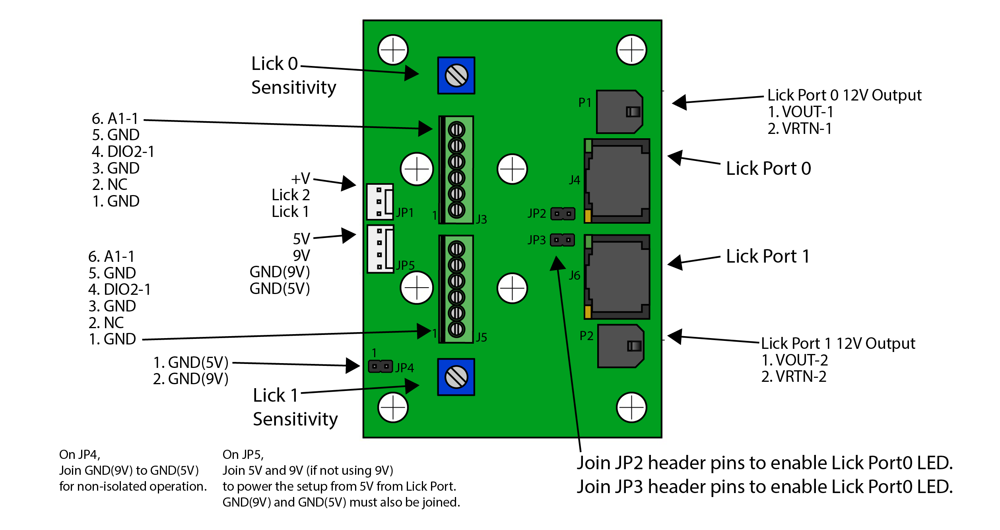

# Lick Detector Electro

This is a migration of the Dual Lick Port project from Janelia Research Campus.

## Connection Overview

## Schematic

[schematic.pdf](./board/JF-SV-LP0001REVA.pdf)

## Device Overview

The Dual Lick Port uses a [two-transistor amplifier circuit](https://www.electronics-notes.com/articles/analogue_circuits/transistor/amplifier-npn-pnp-two-transistor-circuit.php) to detect licks from an instrumented lick port where the mouse receives liquids.
This detection circuit can be operated isolated or non-isolated from the output signal made available on each Lick Port.

Lick Ports can be plugged directly into a a Harp Behavior Device Port as-is with a CAT6 cable.

This board also exposes each Lick Port's 12V output via the two Molex Microfit 3 sockets on the top-and-bottom right side of the board.

## Errata
This mouse's body is connected to a live 9V line in this configuration.
The result is that an accidental connection to GND elswhere in the setup will pass an unregulated amount of current through the mouse.

## References
* [A Simple 2-Transistor Touch or Lick Detector Circuit](https://www.ncbi.nlm.nih.gov/pmc/articles/PMC2648519/)
    * A similar circuit and application
